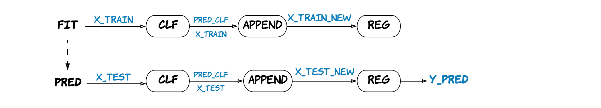

# Introduction
## Project Goal
The Goal of this Project is to use **session-level** data to predict **user-level** e-commerce revenue for Google GStore.

## Challenge
- **Extremly Imbalanced Data: Almost 99% V.S. 1%** 
	- **98.7%** of sessions **did not** make a transaction
	- **98.6%** of users **did not** make a transaction
* **Lack of continuous variables**   
Most data in web traffic is **catagorical** data. Catagorical data like device information, geographic location, time, redirect information, etc is hard to be put in our model directly.

* **User-level data**  
The data we have is in session-level. Should we use session-level data on our model directly or aggregateit to user-level first?

# Highlight
## Feature Engineering
* Transcation Level: Create **Dummy variables** for categorical Data
* User level: Aggregate variables to continous variables through calculating **mean/frequency/rate**

## Customized stacking estimator
The Best Stacking Estimator we created works like this:   

# Summary
* **Three Modeling Approach**
	- **Regreesion Only:** Linear Regreesion/ Lasso/ RandomForestRegressor
	- **Stacking:** Classification + Regression
	- **Boosting:** Light BGM
* **The Best Model after Grid Search**
	- **Light GBM** in User-level with lowest **RMSE around 1.63**
	- **Stacking model using Bagging SVC and RandomForestRegressor** in User-level with RMSE around 1.64
	- **RandomForestRegressor Only** in User-level with RMSE around 1.70
* **What we learn from this Project**  
	- The model we have reduced the **39.4%** mean squared error. 
	- Using User-level data can provide more information and performs better with our models. 
	- In our case, complicated models like Light GBM works better than regression only models.
